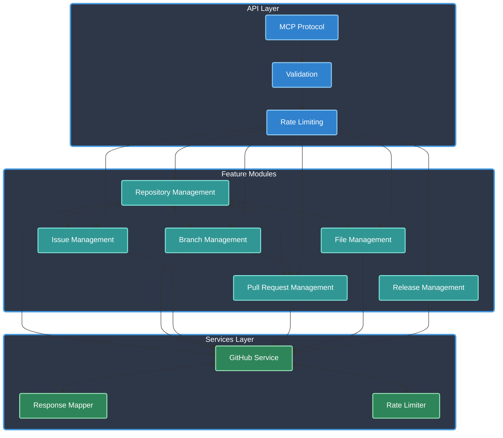

# GitHub MCP Server

[](https://www.typescriptlang.org/)
[](https://github.com/anthropics/modelcontextprotocol)
[]()
[](https://opensource.org/licenses/Apache-2.0)
[]()
[](https://github.com/cyanheads/github-mcp-server)

A Model Context Protocol (MCP) server that provides tools for interacting with the GitHub API. This server allows LLM agents manage GitHub repositories, issues, pull requests, branches, files, and releases through a standardized interface.

## Table of Contents

- [Overview](#overview)
  - [Architecture & Components](#architecture--components)
- [Features](#features)
  - [Repository Management](#repository-management)
  - [Branch Management](#branch-management)
  - [Issue Management](#issue-management)
  - [Pull Request Management](#pull-request-management)
  - [File Management](#file-management)
  - [Release Management](#release-management)
- [Installation](#installation)
  - [Prerequisites](#prerequisites)
  - [Setup](#setup)
- [Configuration](#configuration)
- [Project Structure](#project-structure)
- [Tools](#tools)
  - [Repository Management Tools](#repository-management-tools)
  - [Branch Management Tools](#branch-management-tools)
  - [Issue Management Tools](#issue-management-tools)
  - [Pull Request Management Tools](#pull-request-management-tools)
  - [File Management Tools](#file-management-tools)
  - [Release Management Tools](#release-management-tools)
- [Development](#development)
  - [Project Structure](#project-structure-1)
  - [Scripts](#scripts)
- [Error Handling](#error-handling)
- [Contributing](#contributing)
- [License](#license)

## Overview

github-mcp-server implements the Model Context Protocol (MCP), enabling standardized communication between LLMs and external systems through:

- **Clients**: Claude Desktop, IDEs, and other MCP-compatible clients
- **Servers**: Tools and resources for project management and collaboration
- **LLM Agents**: AI models that leverage the ability to perform GitHub operations programmatically.

It acts as a bridge between AI models and the GitHub API, offering a set of well-defined tools that follow consistent patterns and handle authentication, validation, error handling, and rate limiting.

Key capabilities:

- **GitHub API Integration**: Secure and seamless integration with GitHub's REST API
- **Comprehensive GitHub Features**: Complete management of repos, branches, issues, PRs, and more
- **Atomic Feature Architecture**: Well-organized modular code structure for maintainability
- **Input Validation**: Robust validation with Zod schemas for all operations
- **Error Handling**: Consistent error categorization and reporting
- **Rate Limiting**: Built-in GitHub API rate limit handling
- **Performance Focus**: Optimized operations and response formatting

### Architecture & Components

Core system architecture:

<details>
<summary>Click to expand Mermaid diagram</summary>



</details>

Core Components:

- **MCP Protocol Layer**: Handles communication with AI assistants
- **Validation Layer**: Ensures data integrity through schema validation
- **GitHub Service**: Core integration with GitHub REST API
- **Rate Limiter**: Prevents API rate limit exhaustion
- **Feature Modules**: Domain-specific GitHub operations
- **Error Handling**: Comprehensive error handling and logging system

## Features

### Repository Management

- **Create, List, Get**: Create new repositories, list user repositories, and get detailed repository information
- **Validation & Configuration**: Validate repository settings and manage configuration options

### Branch Management

- **Create, Delete, List**: Complete branch lifecycle management with secure validation
- **Protected Branch Support**: Filtering and operations for protected branches

### Issue Management

- **Create & List**: Create detailed issues with labels and list issues with filtering options
- **Status Tracking**: Filter by issue state (open, closed, all)

### Pull Request Management

- **Create, Update, Merge, List**: Full pull request lifecycle management
- **Review & Comment Integration**: Add reviews and comments to pull requests
- **Merge Options**: Support for different merge strategies (merge, squash, rebase)

### File Management

- **Create & Update Files**: Add and modify repository content with commit messages
- **Base64 Encoding Support**: Handle both text and binary file content

### Release Management

- **Create Releases**: Create tagged releases with customizable options
- **Draft & Prerelease Support**: Support for draft and prerelease workflows

## Installation

### Prerequisites

- Node.js (v16 or newer)
- A GitHub personal access token with appropriate permissions

### Setup

1. Clone the repository:

   ```bash
   git clone https://github.com/cyanheads/github-mcp-server.git
   cd github-mcp-server
   ```

2. Install dependencies:

   ```bash
   npm install
   ```

3. Create a `.env` file in the project root with your GitHub token:

   ```
   GITHUB_TOKEN=your_github_personal_access_token
   LOG_LEVEL=info
   SERVER_NAME=github-mcp-server
   SERVER_VERSION=0.1.0
   ```

4. Build the project:

   ```bash
   npm run build
   ```

5. Start the server:
   ```bash
   node build/index.js
   ```

## Configuration

The server can be configured through environment variables:

| Environment Variable            | Description                                     | Default           |
| ------------------------------- | ----------------------------------------------- | ----------------- |
| `GITHUB_TOKEN`                  | GitHub personal access token (required)         | -                 |
| `LOG_LEVEL`                     | Logging level (debug, info, warn, error, fatal) | info              |
| `SERVER_NAME`                   | MCP server name                                 | github-mcp-server |
| `SERVER_VERSION`                | MCP server version                              | 0.1.0             |
| `API_TIMEOUT_MS`                | Timeout for API calls in milliseconds           | 10000             |
| `RATE_LIMITING_ENABLED`         | Whether rate limiting is enabled                | true              |
| `RATE_LIMITING_MIN_REMAINING`   | Minimum remaining requests before throttling    | 100               |
| `RATE_LIMITING_RESET_BUFFER_MS` | Time buffer to add to rate limit reset time     | 5000              |

### MCP Client Settings

Add to your MCP client settings:

```json
{
  "mcpServers": {
    "github": {
      "command": "node",
      "args": ["/path/to/github-mcp-server/build/index.js"],
      "env": {
        "GITHUB_TOKEN": "your_github_personal_access_token",
        "LOG_LEVEL": "info",
        "SERVER_NAME": "github-mcp-server",
        "SERVER_VERSION": "0.1.0"
      }
    }
  }
}
```

## Project Structure

This project follows an atomic feature-oriented architecture pattern:

```
/src
  /configuration             // Application configuration
  /dependencyInjection       // Tool registry and DI container
  /features                  // Feature modules organized by domain
    /repositoryManagement
      /resources             // Read operations
      /modifications         // Write operations
    /branchManagement
    /issueManagement
    /pullRequestManagement
    /fileManagement
    /releaseManagement
  /services                  // External service integrations
    /githubAccess            // GitHub API client and utilities
  /types                     // Core type definitions
  /utilities                 // Helper functions and utilities
```

Each feature domain is split into:

- **Resources**: Read operations that don't modify data
- **Modifications**: Write operations that create, update, or delete data

Each operation is contained in its own directory with:

- Operation implementation file
- Type definitions file
- Export index file

## Tools

GitHub MCP Server provides a comprehensive suite of tools for interacting with GitHub:

### Repository Management Tools

| Tool                | Description                                                                                          |
| ------------------- | ---------------------------------------------------------------------------------------------------- |
| `get_repository`    | Get detailed information about a specific repository<br>Parameters: `owner`, `repo`                  |
| `list_repositories` | List repositories for the authenticated user<br>Parameters: `type` (optional), `sort` (optional)     |
| `create_repository` | Create a new GitHub repository<br>Parameters: `name`, `description` (optional), `private` (optional) |

### Branch Management Tools

| Tool            | Description                                                                                                 |
| --------------- | ----------------------------------------------------------------------------------------------------------- |
| `list_branches` | List branches in a repository<br>Parameters: `owner`, `repo`, `protected` (optional), `per_page` (optional) |
| `create_branch` | Create a new branch<br>Parameters: `owner`, `repo`, `branch`, `sha`                                         |
| `delete_branch` | Delete a branch<br>Parameters: `owner`, `repo`, `branch`                                                    |

### Issue Management Tools

| Tool           | Description                                                                                                        |
| -------------- | ------------------------------------------------------------------------------------------------------------------ |
| `create_issue` | Create a new issue in a repository<br>Parameters: `owner`, `repo`, `title`, `body` (optional), `labels` (optional) |
| `list_issues`  | List issues in a repository<br>Parameters: `owner`, `repo`, `state` (optional), `labels` (optional)                |

### Pull Request Management Tools

| Tool                  | Description                                                                                                                                                                                     |
| --------------------- | ----------------------------------------------------------------------------------------------------------------------------------------------------------------------------------------------- |
| `create_pull_request` | Create a new pull request<br>Parameters: `owner`, `repo`, `title`, `head`, `base`, `body` (optional)                                                                                            |
| `merge_pull_request`  | Merge a pull request<br>Parameters: `owner`, `repo`, `pull_number`, `commit_title` (optional), `commit_message` (optional), `merge_method` (optional)                                           |
| `update_pull_request` | Update an existing pull request<br>Parameters: `owner`, `repo`, `pull_number`, `title` (optional), `body` (optional), `state` (optional), `base` (optional), `maintainer_can_modify` (optional) |
| `list_pull_requests`  | List pull requests in a repository<br>Parameters: `owner`, `repo`, `state` (optional), `head` (optional), `base` (optional), `sort` (optional), `direction` (optional)                          |

### File Management Tools

| Tool          | Description                                                                                                                                 |
| ------------- | ------------------------------------------------------------------------------------------------------------------------------------------- |
| `update_file` | Create or update a file in a repository<br>Parameters: `owner`, `repo`, `path`, `message`, `content`, `sha` (optional), `branch` (optional) |

### Release Management Tools

| Tool             | Description                                                                                                                                        |
| ---------------- | -------------------------------------------------------------------------------------------------------------------------------------------------- |
| `create_release` | Create a new release<br>Parameters: `owner`, `repo`, `tag_name`, `name` (optional), `body` (optional), `draft` (optional), `prerelease` (optional) |

## Development

### Project Structure

The project follows strict naming conventions and directory structure:

- File naming: `action.entity.type.ts` (e.g., `create.repository.operation.ts`)
- Each module has a clearly defined purpose
- Types are co-located with their implementation
- All exports are centralized through index files

### Scripts

- `npm run build` - Build the project
- `npm run watch` - Watch for changes and rebuild
- `npm run inspector` - Run the MCP inspector tool
- `npm run clean` - Clean build artifacts
- `npm run rebuild` - Clean and rebuild the project
- `npm run tree` - Generate a directory tree representation

## Error Handling

The server implements a comprehensive error handling strategy:

- **Standardized Error Objects**: Consistent error format with categorization
- **Input Validation**: Pre-validation using Zod schemas
- **Rate Limiting Protection**: Automatic handling of GitHub API rate limits
- **Error Categories**:
  - Network errors (connectivity issues)
  - Authentication errors (token problems)
  - Validation errors (invalid input)
  - GitHub API errors (API-specific issues)
  - System errors (unexpected failures)
- **Detailed Logging**: Structured logging for all operations and errors

## Contributing

Contributions are welcome! Please feel free to submit a Pull Request.

1. Fork the repository
2. Create your feature branch (`git checkout -b feature/amazing-feature`)
3. Commit your changes (`git commit -m 'Add some amazing feature'`)
4. Push to the branch (`git push origin feature/amazing-feature`)
5. Open a Pull Request

## License

[Apache License 2.0](LICENSE)

---

<div align="center">
Built with the Model Context Protocol
</div>
